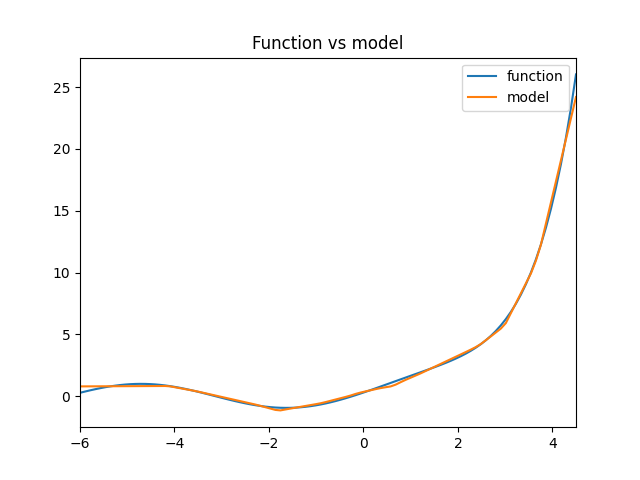
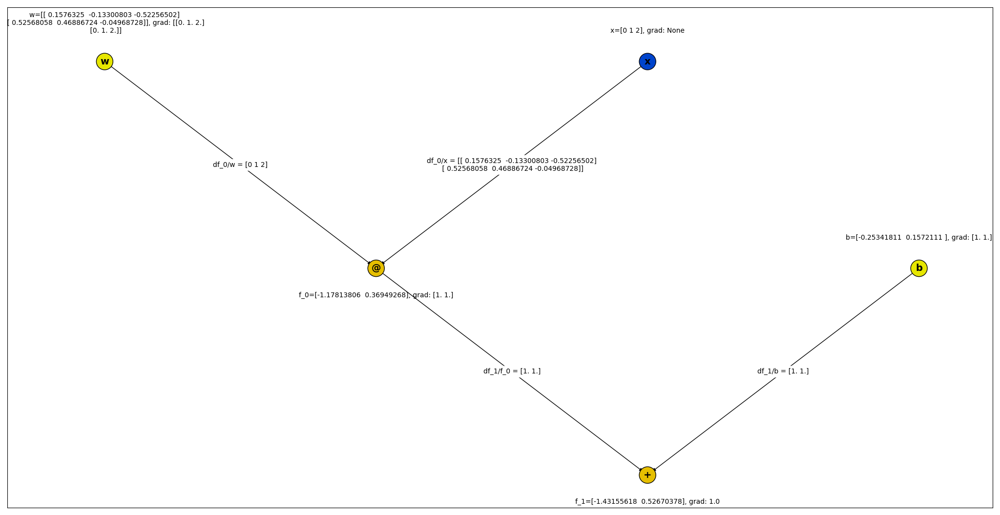

# Neural networks with backprop from scratch 

Educational implementation of neural networks and backprop from scratch using numpy.
Why ? Learning how backprop works and how/why the PyTorch API is designed.

## Features  

- Linear/Dense Layers
- ReLU, Sigmoid, TanH activation functions 
- MSELoss 
- Backprop/autograd for up to 2d-arrays
- Uniform weights initializer
- Plotting of computational graphs including partial derivatives

## Examples 

[function_approximation.py](examples/function_approximation.py) 


[Visualization of Compuational graph](examples/visualize_computational_graph.py)


## Usage 

```python 
model = Sequential([
        Linear(in_features=10, out_features=30),
        ReLu(),
        Linear(in_features=30,
               out_features=30),
        ReLu(),
        Linear(in_features=30, out_features=1),
    ])
x_input = Tensor(np.arange(10))
y_output = model.forward(x_input)
y_output.backward()
```
## Install

Install this package including it's dependencies with:

```
pip install -e .
```

Installing graphviz on Windows:
As there is no proper installer for graphviz, on Windows you have to download it, unzip it anywhere and add the bin subfolder to your PATH to get the graph drawing to work.

## Run example 

```sh
cd examples
python function_approximation.py
```

## Run tests 

To run the tests, pytorch is required as dependency to suit as a reference. 
```
python -m unittest
```

## License 

This software is licensed under MIT.

## Reference: 

- [The excellent course CS231n from Andrej Karpathy](https://www.youtube.com/watch?v=i94OvYb6noo)
- [PyTorch Documentation](https://pytorch.org/docs/stable/index.html)
- https://karpathy.medium.com/yes-you-should-understand-backprop-e2f06eab496b

# Similar projects 

- [tinygrad](https://github.com/geohot/tinygrad)
- [micrograd](https://github.com/karpathy/micrograd)