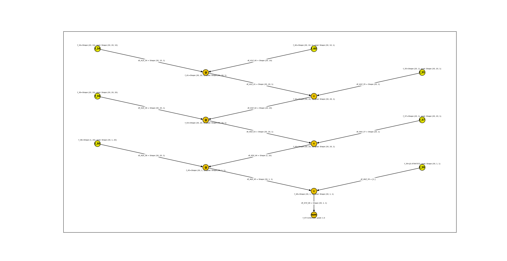

# Vectorizing Layers for accepting batch-sized input 

For the curve-fitting problem, we observe one mistake, which we actually did when implementing the layers:

For a fitting problem, we have a list training examples with corresponding ground-truth values, lets call them `x_train` and `y_train` and we can forward each of the them through the neural net and calculate the the deviation from the `y_train` sample. 

Then, we adjust the parameter of the neural net such that it predicts all better, not a single example, but rather all examples should be predicted better. 
The loss, which we calulate is w.r.t. to all training examples. So we have to forward each training example, calculate the squared difference betwenn the true y value 
and add all of these values up. 

But we actually want to be able to call `forward` with an array of training examples, such that we do not have to implement this looping over each training example every time. 
We can easily implement this with tensors and this concept makes a lot of sense, as the tensor containing the training data will just have one additional axis. 
This is the way how it is done in PyTorch, each nn.Module expects a tensor of shape `(batch_size, ...)`.

So we will need to change the implementation of our Layers to accept a tensor of trainings examples. 

For this, we will use numpy's [broadcasting]() as we do not have to loop in Python over training examples and the implementation is thus faster. 

In Numpy, the broadcasting rules allow us automatically for example to add a scalar value element-wise to a vector, an operation not allowed by linear algebra:

Because of broadcasting, our addition and subtraction methods already work for batch-sized inputs, we don't have to modify them.

## Multiplication 

For the multiplication to work, we have to modify it slightly, first the scalar-vector multiplication case: 
If we a batch-sized tensor with scalars and want to multiply  it with a weights-vector, we have to a `(batch_size, 1)`-shaped tensor of the training data 
and a `(vector_size,)`-shaped tensor of weights for the broadcasting to work: 

# new derivation:

First, we need to remove the assert for + and minus for the same shape, as now different shapes can be summed element-wise because of broadcasting. Now also the partial derivatives are ones of the respective operands shapes

Now, we need also to change the transposition, and replace .T with np.swapaxes(B, -1, -2), as for more than 2d arrays, numpy's .T does not give the expected result.

Also, in the linear layer we notice a bug in the summing with the bias vector: 

It has to be of shape (feature_size, 1) instead of (feature_size,)

Now, the last modification we have to make is to sum over the batch axis and reshape the gradient tensor to match the value of which we are calculating the shape: 

TODO 

